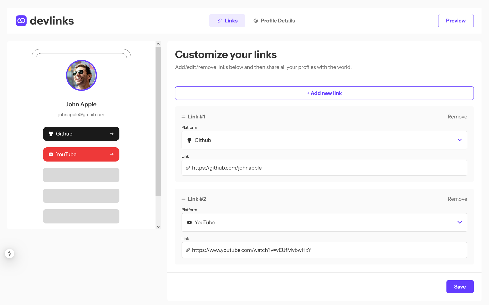
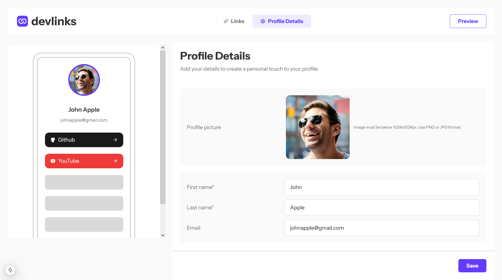
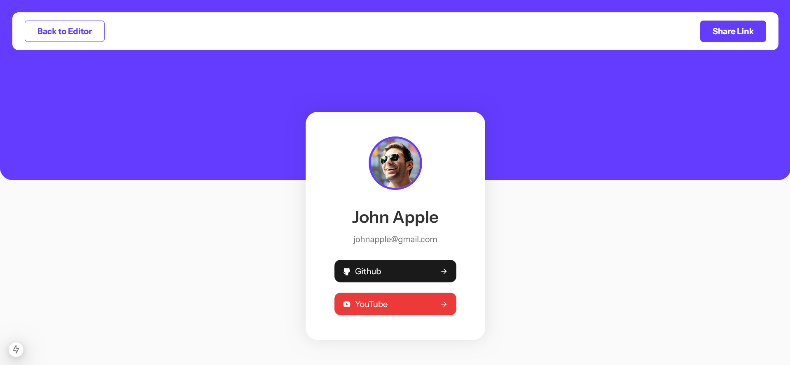

# Frontend Mentor - Link-sharing app solution

This is a solution to the [Link-sharing app challenge on Frontend Mentor](https://www.frontendmentor.io/challenges/linksharing-app-Fbt7yweGsT). Frontend Mentor challenges help you improve your coding skills by building realistic projects. 

## Table of contents

- [Overview](#overview)
  - [The challenge](#the-challenge)
  - [Screenshot](#screenshot)
  - [Links](#links)
- [My process](#my-process)
  - [Built with](#built-with)
  - [What I learned](#what-i-learned)
  - [Useful resources](#useful-resources)
- [Author](#author)
- [Acknowledgments](#acknowledgments)

## Overview

### The challenge

Users should be able to:

- Create, read, update, delete links and see previews in the mobile mockup
- Receive validations if the links form is submitted without a URL or with the wrong URL pattern for the platform
- Drag and drop links to reorder them
- Add profile details like profile picture, first name, last name, and email
- Receive validations if the profile details form is saved with no first or last name
- Preview their devlinks profile and copy the link to their clipboard
- View the optimal layout for the interface depending on their device's screen size
- See hover and focus states for all interactive elements on the page
- **Bonus**: Save details to a database (build the project as a full-stack app)
- **Bonus**: Create an account and log in (add user authentication to the full-stack app)

### Screenshot







### Links

- Solution URL: [Solution URL](https://dev-links-nu-sandy.vercel.app)

## My process

### Built with

- Semantic HTML5 markup
- CSS custom properties
- Flexbox
- CSS Grid
- TailwindCSS
- Mobile-first workflow
- Next.js
- React Query
- Dnd Kit
- Axios
- Zod
- Express.js
- PostgreSql
- Prisma

### What I learned

In this project for the first time I used compound component in React. The most important I learned it and understand how to use it.

```jsx
  <Select
    value={currentLink.platform}
    onChangeValue={handleChangeSelect}>
    {PLATFORMS_LIST.map(item => (
      <Select.Item key={item.value} value={item.value}>
        {item.icon} {item.value}
      </Select.Item>
    ))}
  </Select>
```

### Useful resources

- [Resource for learning compound component in React](https://www.youtube.com/watch?v=N_WgBU3S9W8) - This helped me for understanding how compound component in React works and how to use it. I also recommend this channel for anyone who wants to learn React

## Author

- My website - [https://portfoliomateuszbizon.netlify.app/](https://portfoliomateuszbizon.netlify.app/)
- Frontend Mentor - [https://www.frontendmentor.io/profile/mateuszbizon](https://www.frontendmentor.io/profile/mateuszbizon)
- LinkedIn - [https://www.linkedin.com/in/mateusz-bizo%C5%84-ab5672304/](https://www.linkedin.com/in/mateusz-bizo%C5%84-ab5672304/)
